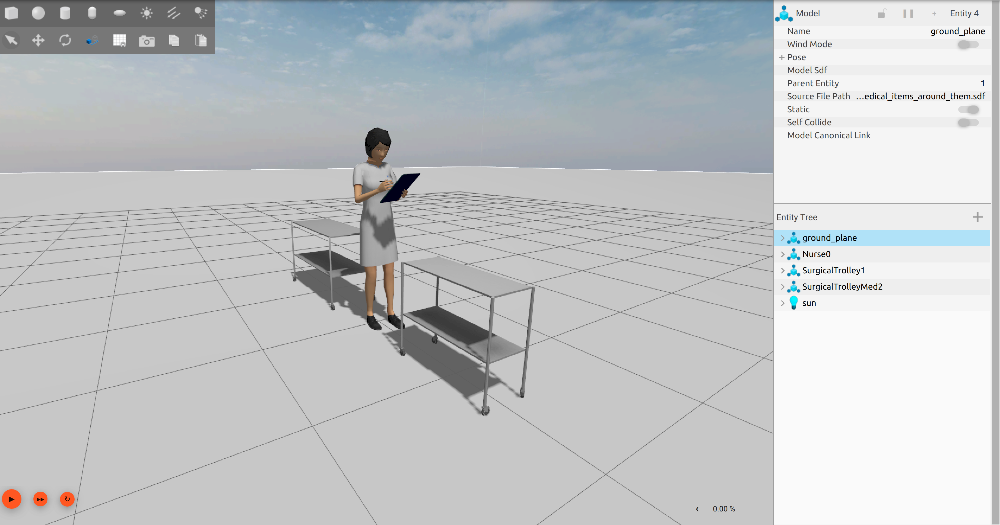
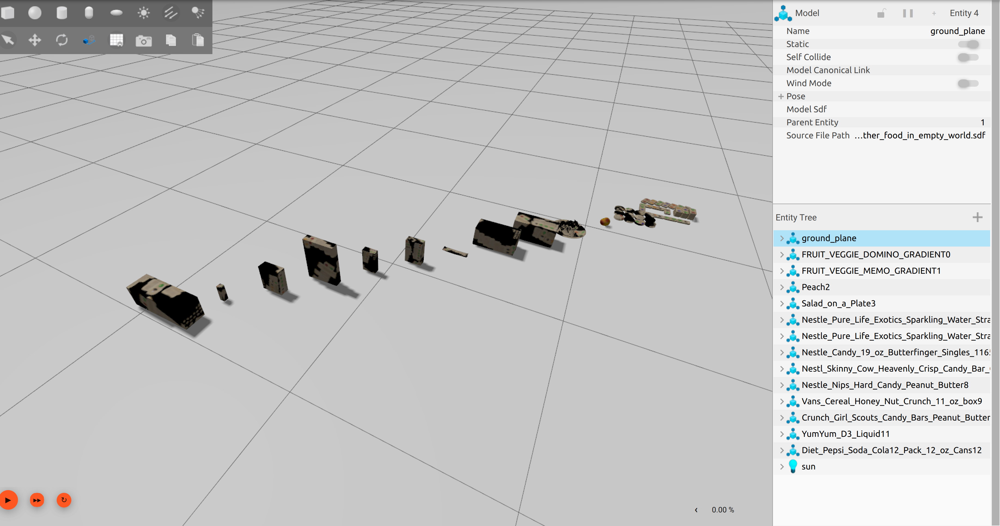
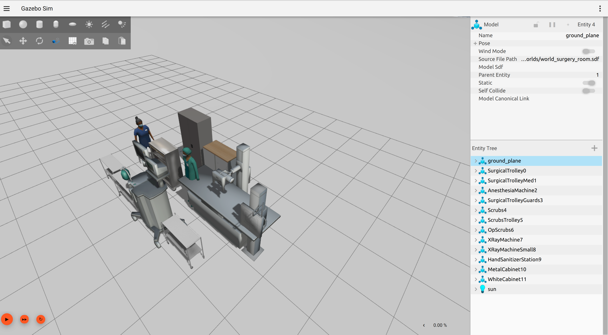
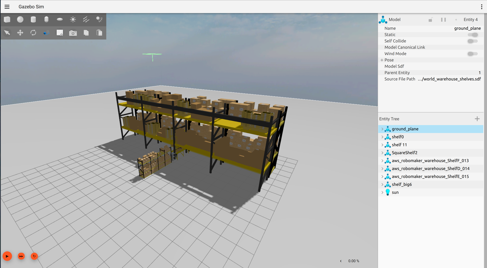
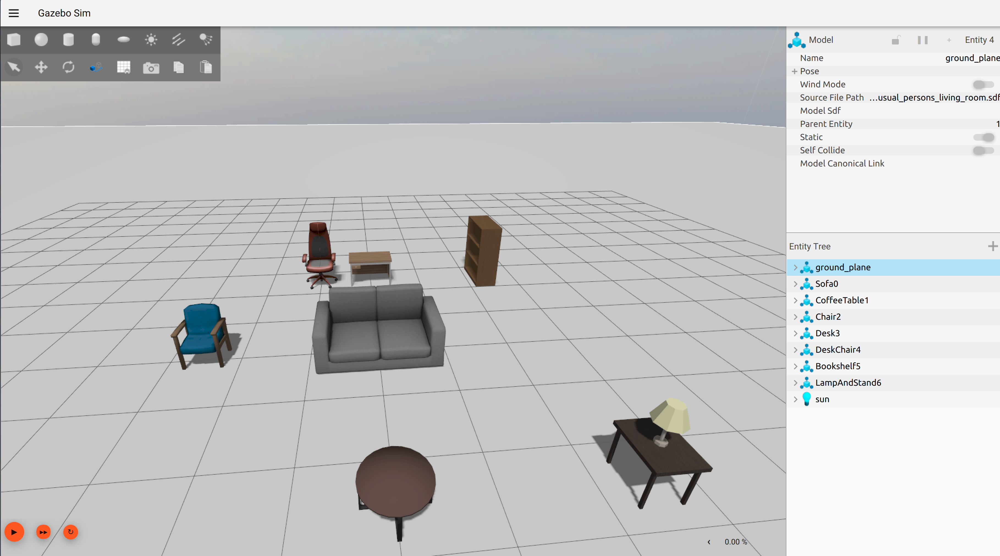
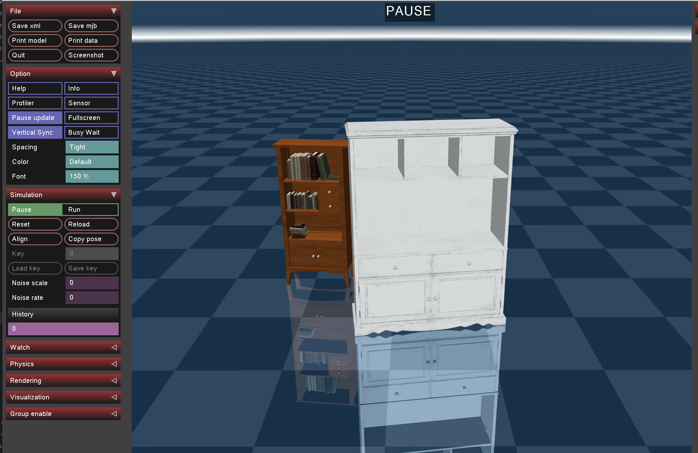

[](https://ciare.dev)

[](https://github.com/ciare/world-creator/issues)
[](https://github.com/ciare/world-creator/pulls)
[](https://www.apache.org/licenses/LICENSE-2.0)

Ciare World Creator is a CLI tool that reimagines the creation of simulation worlds for robotics. We have a vision that in the future you will not be obliged to painstakingly craft detailed SDF files. With Ciare, you will be able to effortlessly generate dynamic and realistic simulation environments by simply providing input text. Whether you're testing robot navigation or experimenting with new solutions, Ciare intelligently spawns models, freeing you from the complexities of precise object placement. By harnessing the power of Language Models (LLMs), Ciare empowers developers to rapidly prototype and explore their ideas, simplifying the simulation process and unlocking a world of possibilities for innovation.

Imagine a scenario where you want to test the navigation capabilities of a robot. With Ciare World Creator, you no longer have to spend hours meticulously positioning every object in the simulation. Instead, you simply provide input text to the Ciare pipeline, and it takes care of the rest. Ciare intelligently spawns models in a reasonable manner, allowing you to focus on testing your solution in a simulated environment that closely resembles real-world scenarios.

<p align="center">
  
</p>

# Features

## Current limitations

Currently it's Proof Of Concept solution. There will be a lot of future development. Right now it really does often hallucinate and it's spatial notion is not that great, but sometimes it generates something cool.

Also complex models(like robots) currently is impossible to include. Work will be done on that in the future. Also complex textures of the models are not properly loading too.

[Objaverse](https://objaverse.allenai.org/) loader for contains a lot of uncurated models with size that is very wrong. Under the hood models try to reason for proper scale, but a lot of times it guesses it wrongly. 

## Integration with other simulators
Generate simulation worlds on the fly with LLMs.

Supports selected simulators, with plans to expand support to all major simulators.
Simulator | Supported
-- | --
Gazebo | 
Mujoco | 
Nvidia Isaac Sim |  
Unity   | 

## Model Database
In the future we want to collect a vast model database from which you can freely choose any model to incorporate into your simulations. It aims to become the largest robotics model database available.

Simulator | Model database
-- | --
Gazebo | [Gazebo fuel](https://app.gazebosim.org/dashboard)
Mujoco | [Objaverse](https://objaverse.allenai.org/)

# Examples

| Prompt  | Generated world |
| ------------- | ------------- |
| Healthcare worker and couple of medical items around them  |   |
| Pile of fruits and other food in empty world |   |
| Surgical room |  |
| Warehouse shelves |  |
| Usual persons living room|  |
| Couple of shelves |  |


# Getting Started

## Installation

### From source using poetry
```
git clone https://github.com/ciare-robotics/world-creator.git
cd world-creator
poetry install
```

### Using pip
```
pip3 install ciare-world-creator
```


## Token configuration

Once you installed ciare, you need to save your OpenAI token by launching `ciare_world_creator create` command first time.

## OpenAI API usage

I estimate that creating single world is only a matter of a few cents.

# How to use

Ciare has couple of commands

```console
Usage: ciare ciare_world_creator [OPTIONS] COMMAND [ARGS]...

  World creator by Ciare

Options:
  --help  Show this message and exit.

Commands:
  create            Create new simulation world
  list              Lists all worlds created by you
  purge             Delete database and all of the worlds you've created
  fix               Sometimes, world downloaded can be malformed, so we will
                   take all objects from that world and respawn them in empty
                     world

```

## Create simulation world

You can crate simulation worlds by using command `ciare_world_creator create`. You will need to prompt any query that will describe your simulation world as precise as possible. Model hallucinate pretty often.

```console
sim@sim:world-creator$ ±|main ✗|→ ciare_world_creator create
? Enter query for world generation(E.g Two cars and person next to it) Multiple cars spawned 5 meters from each other in empty world. One bicycle besides them

Using embedded DuckDB with persistence: data will be stored in: /var/tmp/ciare/chromadb

Generating world... 🌎
World is Test, downloading it
File downloaded successfully.

Spawning models in the world... 🫖

Placing models in the world... 📍

Finished! Output available at /var/tmp/ciare/worlds/world_multiple_cars_spawned_5_meters_from_each_other_in_empty_world_one_bicycle_besides_them.sdf 🦄
```

## List created worlds
You can run `ciare_world_creator list` to view already created worlds. We save every prompt from create command, so later you won't query LLM again.

## Purge database

With `ciare_world_creator purge` you can delete created worlds from local storage and start from scratch.

## Fix malformed world
We take database of worlds from https://app.gazebosim.org/, but sometimes someone puts a world there that doesn't work at all and breaks because of the missing tag or any other error...

To overcome this, you can fix already created world by running `ciare_world_creator fix` command and later typing the name of your world. All models will be spawned in the empty world after that.

# Feedback and contributions
We welcome feedback and contributions from the community to make Ciare World Creator even better. If you encounter any issues, have ideas for improvements, or would like to contribute to the project, please visit the GitHub repository and open an issue or submit a pull request.

Let's create stunning simulation worlds together!

